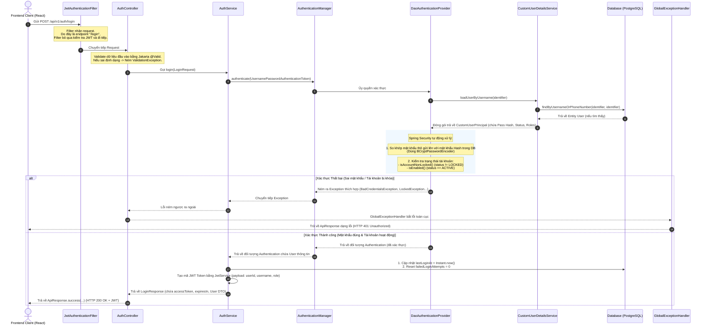

# 📘 HƯỚNG DẪN CHI TIẾT LUỒNG ĐĂNG NHẬP (BE LOGIN FLOW) - KM BANK

Tài liệu này giải thích chi tiết nhất có thể về luồng đi của mã nguồn Backend (Spring Boot / Spring Security) cho chức năng **Đăng nhập (Login)**, kèm theo lộ trình công nghệ cần học để làm chủ toàn bộ kiến thức này.

---

## 🗺️ 1. Sơ đồ tuần tự luồng đi chi tiết (Sequence Diagram)

Dưới đây là sơ đồ tuần tự biểu diễn hành trình của một yêu cầu đăng nhập từ khi Frontend gửi đi cho đến khi nhận được phản hồi:

---

## 🔍 2. Giải thích chi tiết từng bước (Step-by-Step)

### Bước 1: Tiếp nhận yêu cầu tại Filter (`JwtAuthenticationFilter`)
* **Tại sao cần Filter:** Bộ lọc này chặn mọi request đi vào hệ thống để kiểm tra xem có mã Bearer Token JWT ở Header hay không để tự động xác thực người dùng.
* **Với endpoint `/login`:** Vì địa chỉ `/api/v1/auth/login` được cấu hình `.permitAll()` (cho phép truy cập tự do không cần đăng nhập) trong `SecurityConfig`, Filter sẽ phát hiện không có JWT hoặc bỏ qua và cho phép request đi tiếp vào Controller.

### Bước 2: Validation tại Controller (`AuthController`)
* Tham số nhận vào được đánh dấu bằng `@Valid @RequestBody LoginRequest`.
* Thư viện **Jakarta Validation** (Hibernate Validator) sẽ tự động kiểm tra xem các trường dữ liệu gửi lên từ FE có hợp lệ không (ví dụ: không được trống, mật khẩu tối thiểu bao nhiêu ký tự...).
* Nếu không hợp lệ, hệ thống sẽ ném ra `MethodArgumentNotValidException`. Lỗi này sẽ được `GlobalExceptionHandler` bắt và chuyển đổi thành định dạng `VALIDATION_ERROR` chuẩn để gửi về FE.

### Bước 3: Ủy quyền xác thực trong `AuthService`
* `AuthService` nhận yêu cầu và khởi tạo một Token xác thực chưa được chứng thực: `new UsernamePasswordAuthenticationToken(request.getIdentifier(), request.getPassword())`.
* Sau đó, nó gọi `authenticationManager.authenticate()`. Đây chính là lúc "nhường sân chơi" cho cỗ máy bảo mật Spring Security tự động xử lý.

### Bước 4: Lấy dữ liệu và kiểm tra mật khẩu / trạng thái
1. **Lấy dữ liệu:** Spring Security gọi `CustomUserDetailsService.loadUserByUsername()` để tìm kiếm thông tin tài khoản bằng username hoặc số điện thoại trong Database.
2. **Đóng gói thông tin:** Trả về đối tượng `CustomUserPrincipal` thực thi giao diện `UserDetails` của Spring.
3. **So khớp mật khẩu:** Spring Security sử dụng cơ chế `PasswordEncoder` (cụ thể là `BCryptPasswordEncoder`) để so khớp mật khẩu người dùng vừa nhập với mật khẩu đã mã hóa một chiều trong database.
4. **Kiểm tra trạng thái tài khoản:** 
   - Nếu `isAccountNonLocked()` trả về `false` (tài khoản trạng thái `LOCKED`), ném ra `LockedException`.
   - Nếu `isEnabled()` trả về `false` (tài khoản trạng thái `DISABLED`), ném ra `DisabledException`.
   - Nếu mật khẩu không khớp, ném ra `BadCredentialsException`.

### Bước 5: Cập nhật cơ sở dữ liệu và phát hành Token
* Nếu không có ngoại lệ nào bị ném ra ở Bước 4, người dùng được coi là **xác thực thành công**.
* `AuthService` cập nhật lại cơ sở dữ liệu: lưu lại thời điểm đăng nhập hiện tại (`lastLoginAt`) và đưa số lần đăng nhập sai (`failedLoginAttempts`) về 0.
* Gọi `JwtService.generateToken()` để tạo một chuỗi mã hóa JWT chứa thông tin định danh bất biến `userId`, cùng với `username` và quyền hạn `role` để FE có thể giải mã và sử dụng trực tiếp trên client.
* Trả về kết quả thông qua DTO `LoginResponse`.

---

## 🛠️ 3. Lộ trình công nghệ và Kiến thức cần học để hiểu sâu

Để hiểu và tự mình xây dựng được một hệ thống đăng nhập chuẩn doanh nghiệp như trên, bạn cần học các mảng kiến thức sau theo thứ tự:

### 🟢 Cấp độ 1: Nền tảng (Java Core & Web cơ bản)
1. **Java 17 / Java 21 Features:**
   - Hiểu về **Records** (dùng cho các DTO/Response gọn nhẹ như `FieldError`).
   - Hiểu về **Generic Types** (`<T>`) để hiểu cách viết lớp Wrapper đa năng như `ApiResponse<T>`.
2. **HTTP Protocol & REST API:**
   - Các phương thức HTTP (GET, POST, PUT, DELETE).
   - HTTP Status Codes chuẩn: `200 OK`, `400 Bad Request`, `401 Unauthorized` (chưa đăng nhập), `403 Forbidden` (không đủ quyền), `422 Unprocessable Entity` (lỗi validate dữ liệu), `500 Internal Server Error` (lỗi BE).
   - Định dạng dữ liệu **JSON**.

### 🟡 Cấp độ 2: Spring Boot Core & Data Access
1. **Spring IoC (Inversion of Control) & DI (Dependency Injection):**
   - Cách Spring quản lý các Bean bằng `@Component`, `@Service`, `@Repository`, `@Bean`.
   - Cơ chế tự động tiêm phụ thuộc bằng Constructor Injection (hoặc dùng `@RequiredArgsConstructor` của Lombok).
2. **Spring Data JPA & Hibernate:**
   - Cách mapping các Class Java thành Table trong Database thông qua `@Entity`, `@Table`, `@Id`.
   - Hiểu về `JpaRepository`, cách viết Custom Query bằng Method Name (như `findByUsernameOrPhoneNumber`).
   - Hiểu về Transaction management (`@Transactional`) để đảm bảo dữ liệu cập nhật đồng bộ (nếu lưu log thành công mà phát hành token lỗi thì phải rollback dữ liệu lại).

### 🔴 Cấp độ 3: Bảo mật chuyên sâu (Spring Security & JWT)
1. **Kiến trúc Spring Security (Cực kỳ quan trọng):**
   - **Security Filter Chain:** Cách hoạt động của các bộ lọc (Filters) nối tiếp nhau chặn trước Controller.
   - **AuthenticationManager** & **AuthenticationProvider**: Trái tim xác thực của Spring Security.
   - **UserDetails** & **UserDetailsService**: Cách tích hợp thông tin User của database riêng vào hệ sinh thái của Spring.
   - **AuthenticationEntryPoint** (Xử lý lỗi 401) & **AccessDeniedHandler** (Xử lý lỗi 403).
2. **JSON Web Token (JWT) Standard:**
   - JWT cấu tạo gồm 3 phần: **Header**, **Payload** (Claims chứa dữ liệu không nhạy cảm), và **Signature** (Chữ ký số dùng Secret Key để chống giả mạo).
   - Cơ chế xác thực không trạng thái (**Stateless Authentication**): Server không cần lưu Session, mỗi request tiếp theo client chỉ cần gửi kèm JWT trong Header `Authorization: Bearer <token>`.
   - Thuật toán mã hóa chữ ký (như **HS256**).
3. **Mã hóa mật khẩu:**
   - Hiểu về hàm băm một chiều (Hash Function) như **BCrypt** kết hợp kỹ thuật `Salt` (muối) để chống giải mã ngược mật khẩu kể cả khi lộ database.

### 🔵 Cấp độ 4: Quản lý và Kiến trúc dự án
1. **Global Exception Handling:**
   - Sử dụng `@RestControllerAdvice` và `@ExceptionHandler` để bắt mọi loại ngoại lệ tập trung tại một nơi và format lại JSON phản hồi đẹp đẽ cho Frontend, bảo mật thông tin nội bộ của Server (không lộ Stack Trace).
2. **Lombok Library:**
   - Các annotation giúp viết code Java ngắn gọn: `@Data`, `@Getter`, `@RequiredArgsConstructor`, `@Builder` (Design Pattern Builder giúp khởi tạo Object trực quan).
